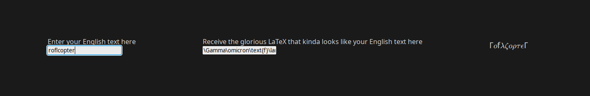

# english2latex

its just a single html page webapp thing that turns your english text into latex that kinda looks like your original text with a preview.. for fun I guess

it uses katex from the cdn to display the preview

to use, just download the index.html file and drag n drop it into your browser or use it on my site if I ever decide to put it up
